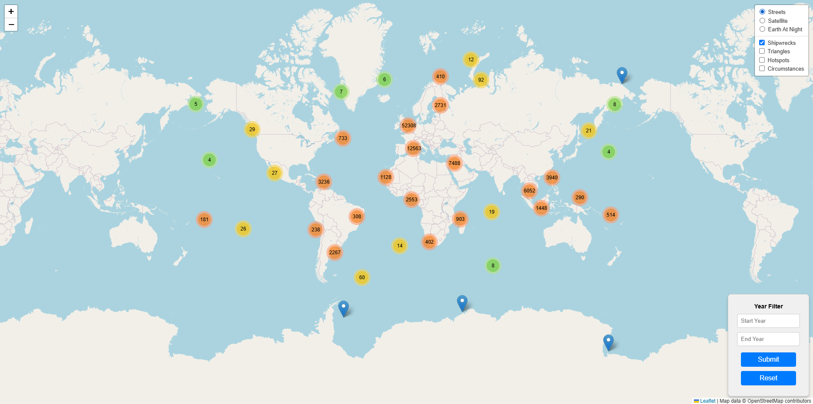
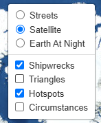
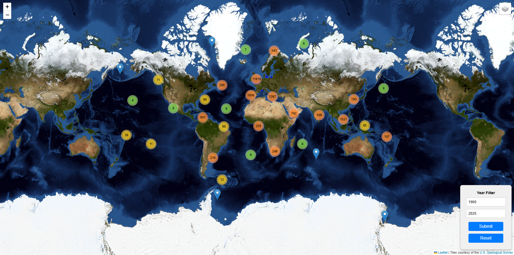

# Shipwrecks Interactive Map

Team Members:
- Arseniy Borsukov
- Kieran Nguyen
- Jay Boon
- Gennadiy Farladansky

## Overview
The Shipwrecks Interactive Map Project visualizes historical shipwreck data, combining technical precision with user-friendly interactivity. The project includes various overlays and tools, such as:
- **Shipwrecks**: Displaying individual shipwreck locations.
- **Hazardous Zones (Triangles)**: Highlighting areas like the Bermuda Triangle.
- **Hotspots**: Showing regions with the highest density of shipwrecks.
- **Consequences**: Filtering shipwrecks with detailed stories of their sinking.
- **Year Filter**: A dynamic year range filter that allows users to specify a start and end year, displaying only shipwrecks within the selected timeframe.

This map was built using data from the [UK Admiralty Maritime Data](https://datahub.admiralty.co.uk/portal/home/item.html?id=4dbf2ace22bf4f9785fb445d0593bc2c). This dataset contains over 100000 unique shipwreck records. Python and the GeoPandas library were utilized to transform the data into JSON and CSV formats, which were then imported into a SQL database via pgAdmin4 for further use. The map was developed using JavaScript and Leaflet and deployed using GitHub Pages.

## Instructions for Use
To interact with the project:
1. **Access the Map**:
   - Visit the [GitHub Pages deployment link](https://arzingy.github.io/project-3-group-2/) or open the [`index.html`](./docs/index.html) file in a web browser.
   - The map will load with default overlays and tile layers.
   
2. **Navigate Layers**:
   - Use the layer control panel to toggle *overlays* like shipwrecks, hazardous zones, density hotspots, or consequences.
   - Use the layer control panel to toggle *tile layers* like satellite, streets, or world at night.
     
3. **Filter by Year**:
   - Use the year filter at the top of the interface to set a start and end year. The map will dynamically update to display only shipwrecks within the specified range.
   
4. **Zoom and Pan**:
   - Navigate the map using zoom controls or by dragging to explore regions of interest.

## Ethical Considerations
During the development of this project, we carefully addressed the following ethical concerns:
- **Data Integrity**: Only data with clear licensing and usage permissions from the UK Admiralty was utilized.
- **Transparency**: Limitations of the dataset, such as incomplete historical records, were acknowledged to avoid misleading users.
- **Inclusivity**: Efforts were made to design the map for accessibility, ensuring the interface is intuitive and inclusive for all users.
- **Privacy**: No sensitive or personally identifiable information was included in the data.

## Important Features
- **Dataset**: The project uses a dataset with over 100000 unique shipwreck records.
- **Database**: Data was imported into a SQL database (pgAdmin4) to streamline querying and integration.
- **Interactive Elements**: The project includes:
  - A dynamic year filter for user-driven data interaction.
  - Layer toggles for visual customization.
  - Four unique data views: shipwrecks, hazardous zones (triangles), density hotspots, and consequences (shipwrecks with known cause).
- **Error-Free Deployment**: The interactive map runs seamlessly without errors.
- **Libraries**: Utilized Python's GeoPandas, Cartopy, and other libraries, which were not covered in class.

## Presentation
- Flourish Presentation: [Is the Bermuda Triangle alone?](https://public.flourish.studio/story/3038012/)

## References
### Data Sources
- UK Admiralty Maritime Data ([UK Admiralty Data Portal](https://datahub.admiralty.co.uk/portal/home/item.html?id=4dbf2ace22bf4f9785fb445d0593bc2c)).

### Code References
- Leaflet JavaScript library ([Leaflet Official Site](https://leafletjs.com)).
- GeoJSON Python library ([GeoJSON on PyPI](https://pypi.org/project/geojson/)).
